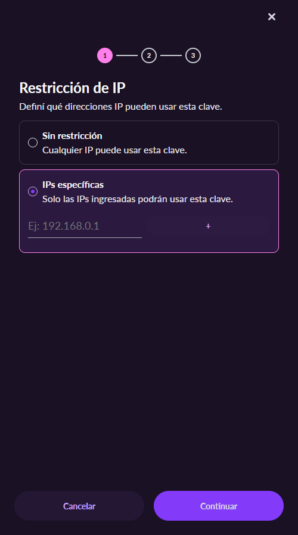
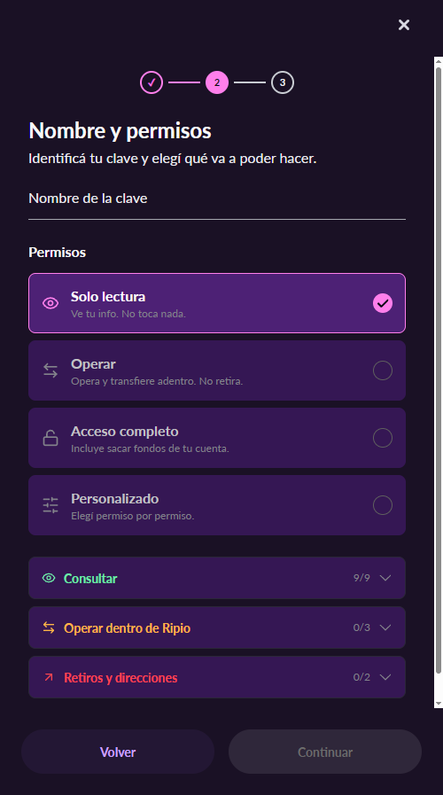

# ripio-community-mcp (español)

[](https://www.npmjs.com/package/ripio-community-mcp) [](https://github.com/ruizemanuel/ripio-community-mcp/actions/workflows/ci.yml) [](LICENSE)

> **No oficial, hecho por la comunidad, sin relación con Ripio.** Solo lectura. Usalo bajo tu responsabilidad.

Un servidor [MCP](https://modelcontextprotocol.io) que corre en tu compu y le permite a tu asistente de IA (Claude, Cursor, etc.) **leer** tu cuenta de Ripio con **tu propia clave de API**: saldos, movimientos, cotizaciones, límites, órdenes abiertas y direcciones de depósito. No puede mover plata.

English version: [README.md](README.md)

## 1. Creá una clave de API de solo lectura

1. Entrá a [app.ripio.com](https://app.ripio.com), hacé clic en tu avatar (arriba a la derecha) → **Perfil** → pestaña **API** → **Nueva clave**.
2. **Restricción de IP:** elegí **IPs específicas** y agregá tu IP pública (recomendado), o **Sin restricción**. Las conexiones hogareñas suelen cambiar de IP pública cada tanto; cuando pasa, el servidor responde con un error 403 hasta que agregues la IP nueva a la clave.

   

3. Poné un nombre y dejá el preset **Solo lectura** (Consultar 9/9, Operar 0/3, Retiros 0/2).

   

4. Confirmá con tu método de verificación en dos pasos y copiá la **API Key** y la **Secret Key**. La secret se muestra una sola vez.

> Aviso: el preset "Solo lectura" de Ripio igual permite registrar cuentas bancarias a tu nombre por API. Este servidor nunca llama a ese endpoint.

## 2. Instalalo

**Claude Desktop (lo más fácil).** Bajá `ripio-community-mcp.mcpb` del [último release](https://github.com/ruizemanuel/ripio-community-mcp/releases/latest). En Claude Desktop, andá a **Configuración** → **Extensiones** → **Configuración avanzada** → **Instalar extensión…**, elegí el archivo y pegá la API key y la secret cuando te las pida. Claude Desktop las guarda en el llavero del sistema. Después preguntale en un chat común, por ejemplo "¿Cuánto tengo en Ripio y en qué?".

**Claude Code**

```bash
claude mcp add --env RIPIO_API_KEY=tu-clave --env RIPIO_API_SECRET=tu-secret --transport stdio ripio -- npx -y ripio-community-mcp
```

**Cursor** (`~/.cursor/mcp.json`)

```json
{
  "mcpServers": {
    "ripio": {
      "command": "npx",
      "args": ["-y", "ripio-community-mcp"],
      "env": { "RIPIO_API_KEY": "tu-clave", "RIPIO_API_SECRET": "tu-secret" }
    }
  }
}
```

Para VS Code, Zed y otros clientes, mirá la sección "Add it to your client" del [README en inglés](README.md#2-add-it-to-your-client). También está en el [MCP Registry](https://registry.modelcontextprotocol.io/v0/servers?search=io.github.ruizemanuel/ripio-community-mcp) oficial como `io.github.ruizemanuel/ripio-community-mcp`, para los clientes que instalan desde ahí.

> **Windows:** si el servidor no arranca (por ejemplo, "Connection closed"), ejecutá `npx` a través de `cmd`. En Claude Code, terminá el comando con `-- cmd /c npx -y ripio-community-mcp`; en las configuraciones JSON, usá `"command": "cmd"` y `"args": ["/c", "npx", "-y", "ripio-community-mcp"]`.

## 3. Preguntale

- "¿Cuánto tengo en Ripio y en qué?"
- "¿Cuáles fueron mis últimos retiros?"
- "¿A cuánto está el USDT en la app y en Ripio Trade?"
- "¿Cuánto me costaría comprar 100 USDT en Ripio Trade?"
- "¿Cuánto puedo retirar hoy?"
- "¿A qué dirección mando USDT por Tron?"
- "¿Esta dirección es mía? Estoy por mandar USDT por Polygon"
- "¿Cuál es mi CVU y mi alias?"

## Depósitos seguros

Una red equivocada, un memo que falta o un solo carácter distinto pueden hacer perder los fondos. Por eso los depósitos tienen capas extra:

1. **La dirección sale exacta.** Las direcciones y los memos salen tal cual los manda Ripio. El servidor nunca crea direcciones: si Ripio todavía no te asignó una para esa red, te dice que inicies ese depósito en la app.
2. **Reglas de red.** `ripio_get_deposit_address` no devuelve una dirección hasta que la red está clara, y dice por qué redes se acredita cada moneda. Tu dirección EVM es la misma en todas las redes EVM, pero Ripio acredita cada moneda solo en algunas.
3. **Verificación por código.** El asistente vuelve a escribir lo que lee, y un modelo de lenguaje puede, muy de vez en cuando, cambiar un carácter. Antes de enviar, pegá la dirección que vas a usar y pedí que la verifique: `ripio_verify_deposit_address` la compara carácter por carácter con tus direcciones reales y avisa si es una copia con errores.
4. **Checksums de las redes.** La mayoría de las redes (EVM con mayúsculas y minúsculas, Tron, Bitcoin, XRP, Stellar…) tienen checksum, así que la billetera que envía suele rechazar una dirección mal copiada. Las direcciones de Solana no tienen.

Para montos grandes, mandá primero un depósito de prueba chico. Son direcciones de la app de Ripio (Wallet); Ripio Trade usa otras.

## Seguridad

- Solo lectura por construcción: el servidor solo puede hacer pedidos GET, y un test lo verifica.
- Solo habla con `https://api.ripio.com`. No tiene telemetría.
- Tus claves no se loguean ni se le pasan al modelo.
- Usá una clave "Solo lectura" con restricción de IP. La podés revocar cuando quieras en Perfil → API.

## Limitaciones

- La API de Ripio no expone los movimientos de tarjeta, las compras/ventas hechas en la app ni los pagos de servicios.
- Los valores son estimados al precio de venta de la app; no son una cotización firme.
- Probado con cuentas de Argentina.
- El extracto de Ripio Trade se puede leer de a 182 días como máximo; para períodos más viejos, pedilo en tramos de unos 6 meses.
- Las direcciones de depósito son las de la app de Ripio (Wallet); las de Ripio Trade todavía no están soportadas.

## Aviso legal

Licencia MIT. No está afiliado, avalado ni soportado por Ripio. Lo que muestra es informativo y no es asesoramiento financiero.
